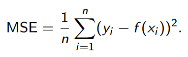
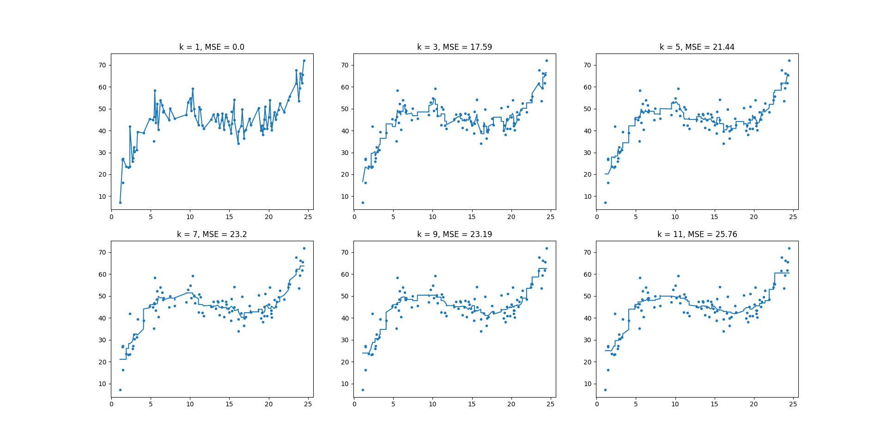

# Report
### Course: 2DV516
### Semester: SS22
### Student: Christoffer Eid
### Teacher: Jonas Lundberg

# Assignment 1
## Excercise 2.5

To check for quality of regression we use an algorithm called the *Mean Squared Error (MSE)*. 



In excercise 2.3 the algorithm is trained on a *training set* to then be MSE-tested on the same set. This produces low MSE-values, however the results dont neccerrealiy have to convert into a good algorithm. What is usually done is that we train our algorithms on a *training set* to then be tested on a *testing set* that the algorith haven't seen before. This to *simulate* real life results, where the alogithm won't be handed data that its trained on before. 


If MSE-tests are done on the same set that its been trained on before, chasing low MSE-values dont make sense since all it will accomplish is an overfitted algorithm that probably wont work very well in real life testing, but will work excellent on just the set its been trained on. 



Figure above shows MSE for training set. For k = 1 this gives us an MSE of 0.0 which looks like a perfect score. However, this is only since the algorithm has been way overfitted. Comparing to the MSE result on the testing set (seen below) we instead receive the highest MSE-score here. An obvious case of overfitting. 

Going from what we've learned, the k that gives the best regression should be the k that gives us the lowest MSE-score on the testing set. Looking at the figure below, we see that this could be any k between 3-11 which interestingly enough all give quite similar results. This can too be expected, seeing from the graphs curvature in k = 3 to k = 11.

```
MSE on test_set for k = 1: 51.41
MSE on test_set for k = 3: 31.31
MSE on test_set for k = 5: 36.18
MSE on test_set for k = 7: 33.12
MSE on test_set for k = 9: 33.39
MSE on test_set for k = 11: 35.0
```
*Output from excercise 2.4*