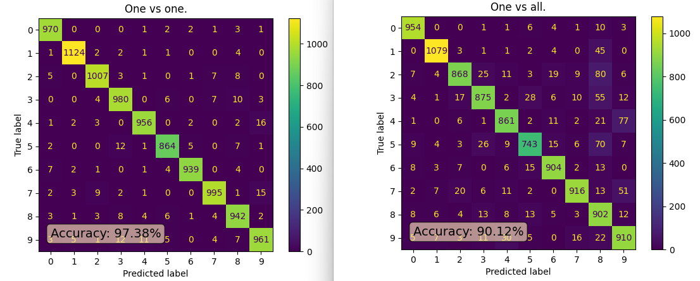

# Report
**Author:** Christoffer Eid, ce223af

## 1: Support vector machines
### Excercise 2: One versus all MNIST

The best classifier was the built in *one vs one*. Both classifiers follow the same patterns in predictions, however the *one vs all* generally predicts worse in all cases. They both have a tendency of over predicting 9's and 8's. 

## 2 Ensemble methods and Decision Trees
### Exercise 4: Ensemble of Batman Trees

I was surprised that the first 99 decision trees did as well as they did, landing on an average of 96.42% accuracy with a standard deviation of only 0.37. What was ecpected was that the best model of the bunch would be the 100th ensembled model. Which had a higher accuracy than all the rest, 97.8%.

The benefits to this model would be better shown if the initial decision trees had a lower and more varying accuracy score, as the final ensembled model would show a greater leap in accuracy improvement. 

Another benefit to random forests over one decision tree is the lessening of overfitting. 

A downside to the forest implementation is the added calculation time. (Atleast in my implementation).

Here are the prints from excercise 4, in case you dont want to run it yourself.

## 3 Neural networks
### Exercise 5: ML in Fashion

Hardest categories to classify are tops. These often get mixed together. I'd assume because they share the same shape. I myself find it hard to classify tops sometimes, so I'd say its quite expected that these categories get mixed up in the classifier. 

Second hardest category would be footwear. They do get mixed up but not as commonly as the tops. 

Easiest to classify would be the bag, as its got nothing like it in the set. 